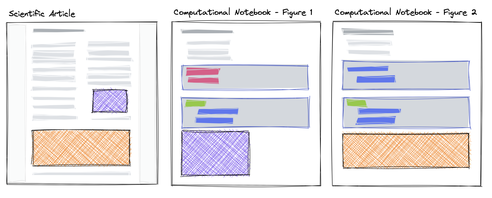

## JATS / MECA Overview

### JATS

[JATS](https://jats.nlm.nih.gov) defines a set of XML elements and attributes designed to represent journal articles in a single standard XML format. A JATS document is a single XML file that includes an `article`, which has `front` matter (authors, affiliations, title, abstract, funding), the `body` of the article (all sections, text, references to figures/images, tables), and the `back` matter (appendix sections, data-availability statements, conflict statements, acknowledgements, and the reference list). JATS only specifies the text content, it is not a format that specifies how to access embedded images, audio, video or other supplemental materials. For example, the following `graphic` specifies a mimetype and an image identifier/link (`xlink:href`).

```xml
<graphic mimetype="image" mime-subtype="tiff" xlink:href="some_image.tif" />
```

How to gain access to this image is underspecified by JATS (as the standard is focused more on _text_\-mining), with each publisher/provider using a different system for gaining access to images (e.g. dynamic image transforms to resize or change to more web-appropriate formats, like `webp`).

We propose using JATS XML to represent a journal article produced using computational notebooks, to include notebook information (source code and outputs) within the JATS XML, and to use specific JATS XML elements to refer to the notebook and computations that were used when producing the article.

### MECA

JATS provides no standardized way to download the full manuscript with all data. In this respect, ideas from the Manuscript Exchange Common Approach ([MECA](https://www.niso.org/standards-committees/meca)) could be adopted to provide a full container for notebooks and other computational requirements. MECA is a National Information Standards Organization (NISO) project which outlines a common means to easily transfer manuscripts and accompanying files between manucript systems.

A MECA file is a single zip file which contains:

- A `manifest.xml` file which describes the contents of the bundle
- A single manuscript as a JATS XML file
- A `transfer.xml` which includes information about the sending and receiving systems
- Content files (arbitrary dependency files) which must be listed in the `manifest.xml`
- There are other optional files as well, read more [here](https://groups.niso.org/higherlogic/ws/public/download/23902/NISO_RP-30-2020_Manuscript_Exchange_Common_Approach_MECA.pdf)

We propose using a MECA file as the single file format for bundling a JATS XML file with it dependencies (external figure images, source notebooks, etc...) for submission to a manuscript system.

+++

### Multiple Notebooks & Cross-Referencing Outputs

In the composition of a scientific narrative, scientists often use individual notebooks to create various components of their research. The outputs of these notebooks (a figure, table, or calculation) is then used in a main, narrative-driven document: a scientific article or presentation. Each notebook may take seconds, hours or days to execute, and may require specific resources or data access.

In some cases, it is possible to collapse all computational information into a single “Executable Research Article”, and visually hide the code to focus on the narrative or presentational flow, rather than the detailed methodology. In our experience, this approach tends to focus on simple reproduction of visualizations from small, cached, or subset data rather than detailed methodology that requires its own explanation and/or lengthy computation. Another approach is to include all individual notebooks, and use the existing abilities of JATS to cross-reference or reuse content. Both approaches are appropriate in different circumstances, and depends on the nature of the research, speed of execution, and if individual steps require dedicated narrative explanation.



> The purple and orange components, interactive figure or other computational outputs, are created in a computational notebook and subsequently used in other narrative or presentation-focused scientific article.

For maximum downstream utility, these notebooks should be included in the full JATS XML. For this purpose we suggest the use of the `sub-article` element for each notebook, or in the 1:1 relationship, the `article` itself. The way in which this XML document is consumed in a viewing context, can of course diverge from the requirements of a single-XML document. With this approach, JATS can take a step towards more fully representing the “research compendium”[^compendium] and align to existing researcher practices.

[^compendium]: For examples and explanations of this, see [The Turing Way](https://the-turing-way.netlify.app/reproducible-research/compendia), any step towards representing the full reproduction of research in the archived VoR is valuable.

### Pragmatic Approach, Graceful Degradation & Updated Versions

We note that data and computation may not be able to be easily replicated in all circumstances (e.g. running a global climate model with terabytes of data, processing confidential data, and many other situations). In a pragmatic sense, any step towards capturing more of the information to reproduce and showing detailed, open methodologies is important. Full computational reproduction is ideal and should be the standard to aim for, however, this need not block incremental progress/adoption of including more methods and data in the archived literature.

Similarly, keeping computational workflows working can be challenging, especially when they are dependent on external data sources, resources, packages, or services. This raises many questions: Should published computational articles be updated if they fail in reproduction? How long should they be maintained for? Again, a pragmatic approach here is important: capturing enough information at publication time to ensure an artifact can degrade gracefully over time. For example, interactive figures should have static analogues or direct screenshots captured, notebooks should be stored including their outputs, widget or other interactive elements should have text-first analogues.

Given the value of computational notebooks, the ability to update the published record should at least be possible. Currently the process of “typesetting” is a costly part of the publishing workflow that disconnects the author with the output of their work (i.e. they are not editing XML and are instead proof-reading converted equations, etc.). In a computational setting, the process of “typesetting” needs to be re-imagined, with the technical, legal and functional ownership of the process to be owned and operated by the researcher, ideally in tools they understand and use. These processes should be, and can be, automated to enable continuous practices by scientists themselves.

## Archiving & Computational Reproduction

Any information that is supplemental is not archived and disemenated in the same way as the single XML document (e.g. in PubMed). In the final, diseminated XML document we want to recreate as much of the notebook **content** as possible for the purposes of indexing and archiving. The constraints on indexing and archiving are different than those on full computational reproduction.

For example, the required software, data, and detailed computational requirements should **not** be stored in this XML document. This is both from a practicality stand point as well as a principle to utilize and reinforce existing standards and communitiy practices that are already adopted (e.g. [REES](https://repo2docker.readthedocs.io/en/latest/specification.html)). Becuase of this, the XML will not be executable on its own. There needs to be standardized ways to bundle notebooks, which we suggest to use the MECA standard (essentially a structured zip file[^zip_github]) which can include all reproducible requirements, representing the notebooks in their canonical form (`.*ipynb`). This has the advantage that much of the existing computational infrastructure (e.g. [Binder](https://mybinder.org)) can be used or adapted relatively easily to consume this file[^binder_zenodo].

[^zip_github]: Note that service providers like GitHub provide ways to download a repository as a zip file dynamically, and this idea can be used to bridge the gap between community-used tools like Git and current standards used in publishing.
[^binder_zenodo]: The Zenodo integration for https://mybinder.org is esentially the same as this, unzipping the contents of a zip-file, and going through community practices for reproducibility.

Our suggested approach to storing the notebooks in JATS is to make the data "round-trippable enough", with the canonical notebooks, source code and data stored as supplementary files in standard forms.
