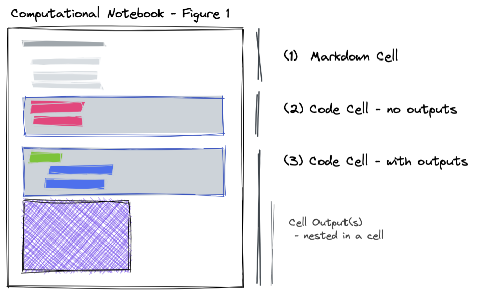

The goal of this article is to recommend community standards for representing Notebooks as [JATS](https://jats.nlm.nih.gov). As discussed in [approach](./approach.md), the notebook can either be the main document of a JATS `article` or as a `sub-article`, which is more appropriate for authors who create figures in different notebooks today, and reference the figures created in those notebooks in the main document.

We propose that all referenced notebooks be represented as:

- A rendering of the notebook, including code and markdown cells, as a JATS `sub-article` of the main the JATS article.
- A copy of the notebook file itself as a Jupyter Notebook file (`.ipynb`) included in the MECA file (referenced via `supplementary-materials`)
- An optional link from the `sub-article` to a deployed version of a notebook (via `self-uri`)
- Optional information about setting up an execution environment for a notebook (via `ext-link` of a specific `type`) in the `sub-article` article metadata.

From within the main `article` within the JATS XML, `xref`s to the `sub-article` or elements within `sub-article` may be used as appropriate.

:::{.callout-note}

This is a very rough `DRAFT`, as we get more authors, we can add stronger language like "we recommend" etc. That may have leaked in already.

:::

## Including Notebooks

(We recommend...) including notebooks as `sub-article`s with the specific `article-type` of `"notebook"`. This choice is made as there are differing requirements on each format. This approach allows the main `article` to follow standard practices of article authoring, e.g. a `"review"` article or similar, with cross-references and inclusion of executable content.

```xml
<sub-article article-type="notebook" id="nb1">
  <front-stub>
    <title-group>
      <article-title>Data access and processing</article-title>
    </title-group>
    <!-- The subarticle should maintain a link to the full, original notebook, e.g. on zenodo -->
    <!-- this allows tools like mybinder, etc to easily integrate -->
    <self-uri xlink:href="https://zenodo.org/record/000001?notebook1.ipynb" content-type="ipynb" assigning-authority="zenodo">Available on Zenodo</self-uri>
    <!-- Additionally, author may include the notebook file in the MECA bundle -->
    <!-- and use a supplementary-material tag to refer to it -->
    <supplementary-material xlink:href="notebooks/source.ipynb" specific-use="document" mimetype="application" mime-subtype="x-ipynb+json" />
  </front-stub>
  <body>
    <!-- Each cell is wrapped in a single sec element, described below -->
    <sec id="nb1-cell-0">...</sec>
    <sec id="nb1-cell-1">...</sec>
    <sec id="nb1-cell-2">...</sec>
  </body>
</sub-article>
```

### Notebook Frontmatter

The inclusion of frontmatter should follow standard practices, using a `front-stub`, at minimum the notebook should include a title for the article. If there are specific authors for each notebook, they can be included here.

There should be a link to other versions of this notebook that are the canonical form. These can be hosted on external repositories (e.g. zenodo, figshare, github) and there can be multiple of these `self-uri` links to where a reader can find the executable, canonical forms of the document.

If the document is stored by the publisher directly, a `supplementary-material` tag can be used, this should point to the same location as it is included in the MECA document.

**TODO:** specific-use: the notebooks can either be the source or an export format (e.g. in using quarto/rmd). Should we list both here, with different content types?

## Components of a Notebook

At a high level a notebook consists of (1) text, which is usually a variant of markdown; (2) executable code cells; and (3) a list of outputs from the execution (many of which can be dynamic or interactive). A notebook also requires an execution environment (with loaded dependencies), and at least one language (e.g. Python, R, Julia, etc.) and version of that language, and can depend on external packages and data.



> We will consider a computational notebook with three cells: (1) a markdown cell, (2) a cell that does not have any outputs, and (3) a cell that has one or more interactive outputs.

### Text

Text is well specified by JATS, and a rich markdown format (e.g. Quarto, Pandoc, or MyST Markdown) should be used here. This can be parsed into a `sec` element with a `sec-type` of `notebook-content`. The notebook cell as [sec](https://jats.nlm.nih.gov/archiving/tag-library/1.3/element/sec.html), can included nested sections, non-executable code, figures, nested boxed text (as callouts or admonitions), or any other narrative content. Note, it is common that these notebook sections may not have a specific title, this is only allowed in the [Archiving](https://jats.nlm.nih.gov/archiving/tag-library/1.3/attribute/disp-level.html) tag set.

```xml
<sec id="nb1-cell-1" sec-type="notebook-content">
  <p>
    This chart shows an example of using an interval selection to filter the contents of an
    attached histogram, allowing the user to see the proportion of items in each category within
    the selection. See more in the
    <ext-link ext-link-type="uri" xlink:href="https://altair-viz.github.io/gallery/selection_histogram.html">
      Altair Documentation
    </ext-link>
  </p>
</sec>
```

:::{.callout-caution}

## Note

By wrapping each notebook markdown cell in a `sec` we are choosing to value the structure of the notebook over the structure of section nesting. The result of this choice is the header depth needs to be explicitly preserved (i.e. using `disp-level`, which is not in the Article Authoring tag set but is provided in [Archiving](https://jats.nlm.nih.gov/archiving/tag-library/1.3/attribute/disp-level.html)). Using the `disp-level` the translation to and from markdown/notebook should be lossless.
:::

### Code

Code is also well specified by JATS, however it needs to be optionally associated with the executable output. Executable code should have the `executable` attribute ([docs](https://jats.nlm.nih.gov/archiving/tag-library/1.3/attribute/executable.html)) on a [code](https://jats.nlm.nih.gov/archiving/tag-library/1.3/element/code.html) element. Each element of executable code should also be included in a `sec` element that is described with a `sec-type` of `notebook-code`. The notebook cell must include at least a single `code` element that is `executable`, the `language` and `language-version` should be included here.

If the `code` does not have associate outputs, for example when importing libraries, then it can be stand-alone in a `sec` element.

```xml
<sec id="nb1-cell-2" sec-type="notebook-code">
  <code language="python" language-version="3.11.1" executable="yes" id="nb1-cell-2-code">
    import altair as alt
    from vega_datasets import data
  </code>
</sec>
```

### Outputs

A code cell in a notebook can have any number of **outputs** (see [nbformat](https://nbformat.readthedocs.io/en/latest/format_description.html#code-cells) as an example), we suggest using a nested `sec` element to capture each output, as they may include text outputs, pre-formatted text (`preformat`), equations (`disp-formula`), graphics and/or interactive media. It is common that notebook outputs provide media in a number of alternative formats (e.g. an interactive HTML figure as well as an image).

```xml
<sec id="nb1-cell-3" sec-type="notebook-code">
  <code language="python" language-version="3.11.1" executable="yes" id="nb1-cell-3-code">
    source = data.cars()

    points = alt.Chart(source).mark_point().encode(
      x='Horsepower:Q',
      y='Miles_per_Gallon:Q',
      size='Acceleration',
      color=alt.condition(brush, 'Origin:N', alt.value('lightgray'))
    )

    points
  </code>
  <sec id="nb1-cell-3-output-0" sec-type="notebook-output">
    <alternatives>
      <media specific-use="original-format" mimetype="application" mime-subtype="vnd.altair.v1+json" xlink:href="nb1-cell-3-altair.json" />
      <media specific-use="web" mimetype="text" mime-subtype="html" xlink:href="nb1-cell-3.html" />
      <graphic specific-use="print" mimetype="image" mime-subtype="jpeg" xlink:href="nb1-cell-3.jpg"/>
    </alternatives>
  </sec>
</sec>
```

### Multiple Outputs

Cells with multiple outputs should contain each output as a `<sec sec-type="notebook-output">`, these are nested inside of the `<sec sec-type="notebook-code">` and should be in the same order as the original notebook. Each output should include an ID so downstream applications can refer to either the entire cell or a single output in the list.

```xml
<sec id="nb1-cell-3" sec-type="notebook-code">
  <code language="python" language-version="3.11.1" executable="yes" id="nb1-cell-3-code">
    ...
  </code>
  <sec id="nb1-cell-3-output-0" sec-type="notebook-output">...</sec>
  <sec id="nb1-cell-3-output-1" sec-type="notebook-output">...</sec>
  <sec id="nb1-cell-3-output-2" sec-type="notebook-output">...</sec>
</sec>
```

**Cell Metadata** (TODO)
: It is likely safe to remove cell metadata for archival purposes? There is a [custom-meta-group](https://jats.nlm.nih.gov/archiving/tag-library/1.3/element/custom-meta-group.html) that can contain arbitrary name/value pairs, however, that is aimed to be included only in the [front-stub](https://jats.nlm.nih.gov/archiving/tag-library/1.3/element/front-stub.html) or [article-meta](https://jats.nlm.nih.gov/archiving/tag-library/1.3/element/article-meta.html). For lossless transformation, we could also put this in a nested media or something?

**Raw Cells** (TODO)
: Include these as a `preformat` element inside of a `sec` instead of a `code`?

### Format Outputs for Viewing & Indexing

Many applications allow for rich information to be included in the output areas, including: rendered markdown, $\LaTeX$ equations, figures with captions, or rich interactive visualizations with fallbacks as images, and many more types.

The most appropriate JATS should be used for the output element with a single parent that corresponds to the output. For example, markdown should become a `p` or `sec` with rendered cross-linked information; $\LaTeX$ equations become a `disp-formula`, figures with captions become a `fig` with a nested `caption` and any alternatives for the image/mime-bundle included inside the `fig` element. If there are multiple alternatives in a single element of the output list, it should be wrapped in an `alternatives` as the top level element in the outputs list.

For example, captions can be included in some markup languages. If that is included in the code, e.g. in Quarto:

```python
#| fig-cap: "A line plot on a polar axis"
```

The markup should be stripped from the code input, and put as a `caption` element, with appropriate markup as a `fig` element. This same functionality is being discussed in Jupyter as `Figure` display object, which will be equivalent but in the output metadata.

```xml
<sec id="nb1-cell-4" sec-type="notebook-code">
  <code>...</code>
  <sec id="nb1-cell-4-output" sec-type="notebook-output">
    <fig id="nb1-cell-4-output-0">
      <caption><title>A line plot on a polar axis</title></caption>
      <graphic specific-use="print" mimetype="image" mime-subtype="jpeg" xlink:href="nb1-cell-4.jpg"/>
    </fig>
  </sec>
</sec>
```

### Referencing an Executable Output

The main `article` can reference executable content pointing to the output where the figure, table, or output came from. In many markup languages is possible using an `embed`, `import`, `include` or `glue` syntax. For computational outputs, there must be `xref` elements contained in a `<supplementary-material specific-use="notebook">` to point to `notebook`, the `notebook-code` and the specific `notebook-output` used. The `<supplementary-material />` should be in a paragraph in the caption of a figure or table and include references to the specific outputs that are used (which can be hidden `xref` elements). At this time, `xref`'s to notebook contents are `ref-type="custom"`, with the appropriate `custom-type` that matches the `article-type="notebook"` or `sec-type` (for code and outputs).

The same `media` or `graphic` or `table` elements can be used as normal JATS, and point to the same output data.

```xml
<fig id="fig3">
  <label>Figure 3</label>
  <caption>
    <title>Orthogroup clustering analysis</title>
    <p>Lorem ipsum dolor sit amet</p>
    <p> <!-- <supplementary-material /> must be in a paragraph! -->
      <!-- This is very likely auto generated, and should indicate it is explaining the notebook-source -->
      <supplementary-material id="fig3-source" specific-use="notebook">
        <label>Figure 3 — Notebook.</label>
        <caption>
          <title>Analysis for <xref ref-type="fig" rid="fig3">Figure 3</xref>.</title>
          <!-- Have a pointer back to the notebook -->
          See methods in <xref ref-type="custom" custom-type="notebook" rid="nb1">Notebook 1</xref>
          <!-- Have a pointer back to the specific cell -->
          from <xref ref-type="custom" custom-type="notebook-code" rid="nb1-cell-3">Cell 4</xref>
          <!-- Specifically point to the notebook output that is used, no need to show that to the reader though! -->
          <xref ref-type="custom" custom-type="notebook-output" rid="nb1-cell-3-output-0" />.
        </caption>
      </supplementary-material>
    </p>
  </caption>
  <!-- Support the same mime-bundles as notebooks with fallbacks for print -->
  <alternatives>
    <media specific-use="original-format" mimetype="application" mime-subtype="vnd.plotly.v1+json" xlink:href="nb1-cell-3-plotly.json" />
    <media specific-use="web" mimetype="text" mime-subtype="html" xlink:href="nb1-cell-3.html" />
    <graphic specific-use="print" mimetype="image" mime-subtype="jpeg" xlink:href="nb1-cell-3.jpg" />
  </alternatives>
</fig>
```

For example, in the case of equations, such as a computed `sympy` equation included in the main article body, these need not be explicitly shown as text, but viewing applications can provide rich links back to the containing notebook and output used. For rich viewing applications that integrate computation, this should be enough information to dynamically update the formula based on recomputing the notebook with new data, for example.

```xml
<disp-formula>
  <tex-math id="eqn5"><![CDATA[ ... ]]></tex-math>
  <xref ref-type="custom" custom-type="notebook" rid="nb1" />
  <xref ref-type="custom" custom-type="notebook-code" rid="nb1-cell-4" />
  <xref ref-type="custom" custom-type="notebook-output" rid="nb1-cell-4-output-0" />
</disp-formula>
```

TODO: This same approach can be taken for other computed elements, such as tables in a `<table-wrap>`.

### Inline Execution & Variables

Semantic publishing tools like Quarto and MyST have the ability to add inline expressions that can be evaluated.
This allows authors to directly refer to variables (e.g. the number of participants or a statistical result).
The results of these computations as well as their source should be recorded in JATS using the `<notes>` field in the `<back>` element of the `article` or `sub-article`.

This provides rich references to specific numbers in an article, and can even be used for inline widgets in articles with alternatives/fallbacks for static renderers (e.g. PDF).
For example, `` The study had {eval}`45 - 3` participants ``, is evaluated to show the text `42`,
and the source of that calculation can be shown to the reader as well as being machine-readable and re-computable on new data in the future.

```xml
<p>
  The study had <xref ref-type="custom" custom-type="expression" rid="eval-15">42</xref> participants.
</p>
...
<back>
  <notes notes-type="expressions">
    <sec sec-type="expression" id="eval-15">
      <code code-type="notebook-code" language="python" language-version="3.11.1" executable="yes" id="eval-15-code">
        45 - 3
      </code>
      <sec sec-type="notebook-output" id="eval-15-output-0">
        <preformat>42</preformat>
      </sec>
    </sec>
  </notes>
</back>
```

### Notebook as the main article

It is possible to use a notebook to author the main article, however, the structure of the JATS in this case is _not_ dictated by the notebook structure, but by the narrative structure. The executable cells are kept in place in the document as hidden sections `<sec sec-type="notebook-code" specific-use="execution">` depending on the intent of the author.

Note: the boundaries of the markdown cells could be kept with `<milestone-start rationale="Markdown cell boundary." specific-use="notebook-content">`
https://jats.nlm.nih.gov/archiving/tag-library/1.3/element/milestone-start.html

For example, an author may want to evaluate a math expression dynamically rather than write it by hand, this can be done concisely in a markup language, evaluated and stored in the `<notes>` in the `<back>` of the article.

```python
from sympy import symbols, expand, factor
x, y = symbols('x y')
polynomial = x*(x + 2*y)
```

```markdown
When {eval}`polynomial` is expanded, it becomes {eval}`expand(polynomial)`.
```

```xml
<sec id="nb1-cell-2" sec-type="notebook-code" specific-use="evaluation">
  <code language="python" language-version="3.11.1" executable="yes" id="nb1-cell-2-code">
    from sympy import symbols, expand, factor
    x, y = symbols('x y')
    polynomial = x*(x + 2*y)
  </code>
</sec>
<p>
  When <xref ref-type="custom" custom-type="expression" rid="eval-1"><inline-formula><tex-math><![CDATA[ x \\left(x + 2 y\\right) ]]></tex-math></inline-formula></xref> is expanded, it becomes <xref ref-type="custom" custom-type="expression" rid="eval-2"><inline-formula><tex-math><![CDATA[ x^{2} + 2 x y ]]></tex-math></inline-formula></xref>.
</p>
...
<back>
  <notes notes-type="expressions">
    <sec id="eval-1" sec-type="expression">
      <code code-type="notebook-code" language="python" language-version="3.11.1" executable="yes"
        id="eval-1-code">
        polynomial
      </code>
      <sec sec-type="notebook-output" id="eval-1-output-0">
        <tex-math><![CDATA[ x \\left(x + 2 y\\right) ]]></tex-math>
      </sec>
    </sec>
    <sec id="eval-2" sec-type="expression">
      <code code-type="notebook-code" language="python" language-version="3.11.1" executable="yes"
        id="eval-2-code">
        expand(polynomial)
      </code>
      <sec sec-type="notebook-output" id="eval-2-output-0">
        <tex-math><![CDATA[ x^{2} + 2 x y ]]></tex-math>
      </sec>
    </sec>
  </notes>
</back>
```

## Restoring Execution Environment

Each `sub-article` that represents a notebook with executable code may also include information about how to restore an execution environment to execute the code within the notebook. We understand that not all notebooks will have the ability to provide such information, but when possible we encourage that authors include this information, allowing journal publishers, reviewers, or other parties to host and execute the notebook code.

When possible, `sub-article`s should include a `ext-link`|`self-uri`|`custom-meta-group` with a path that can be used to restore the execution environment. The path may be:

1. A REES path

   REES (Reproducible Execution Environment Specification) provides a standard approach for reproducing computational environments. It defines a directory containing zero or more configuration files as a valid reproducible execution environment. A broad set of configuration files are supported. A complete list is available [here](https://repo2docker.readthedocs.io/en/latest/config_files.html#config-files).

The element may either provide a local path to a REES compliant folder or provide a remote path to a `git` repo which when cloned will provide a REES complaint folder.

2. A Docker image path

   The element may provide a URI to a Docker image (most likely hosted on a Docker registry).

**TODO:** Discuss specific element that makes the most sense to use.
