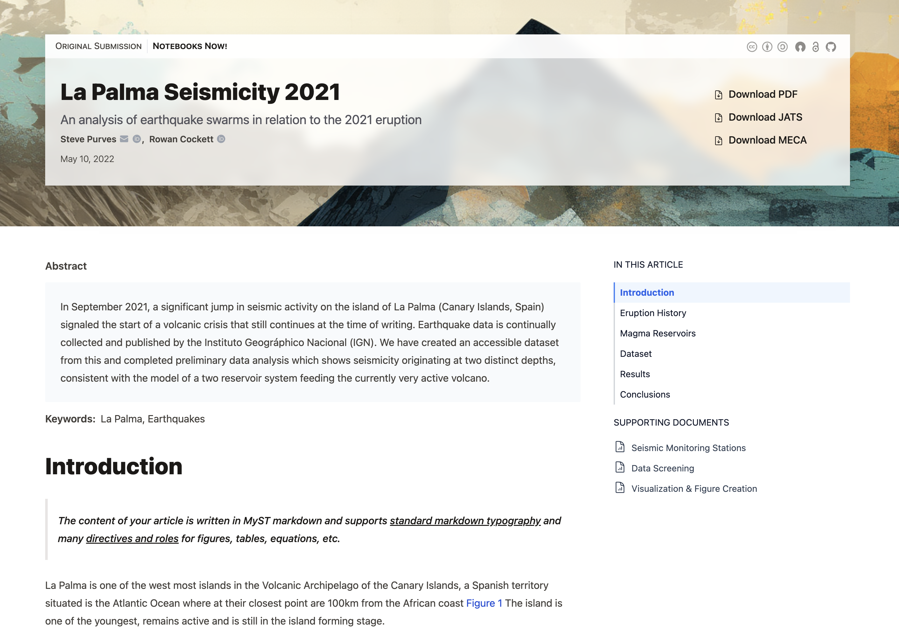
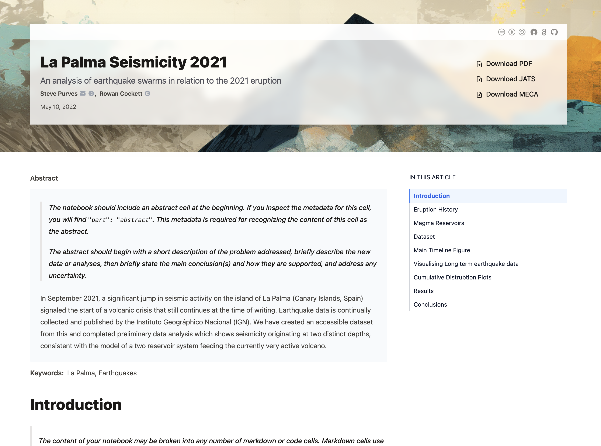
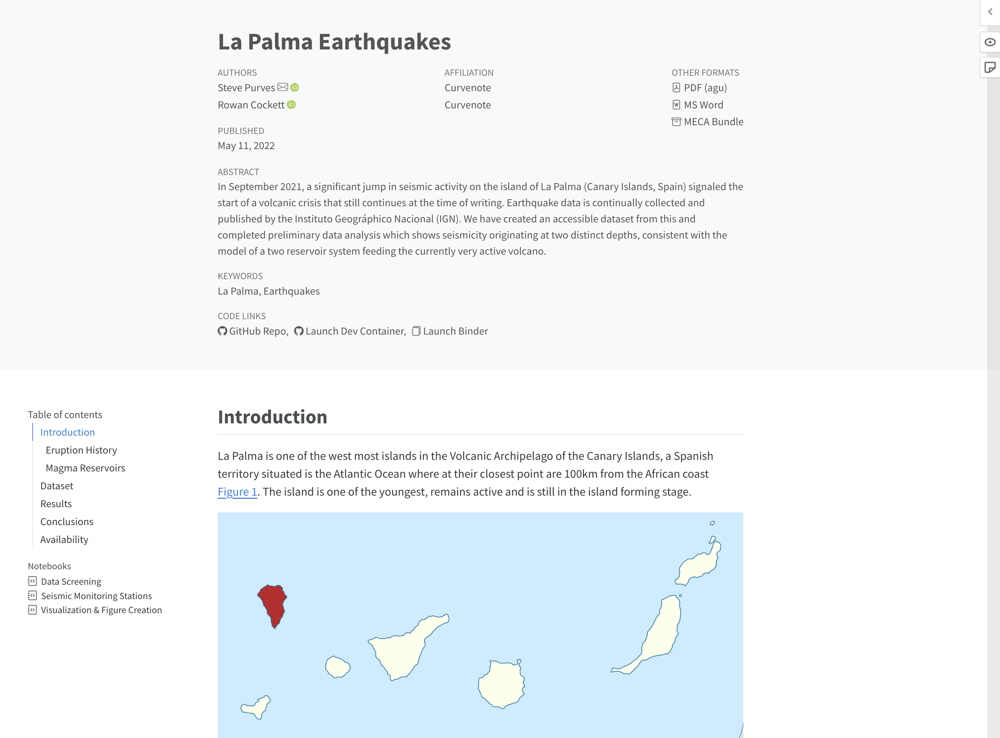
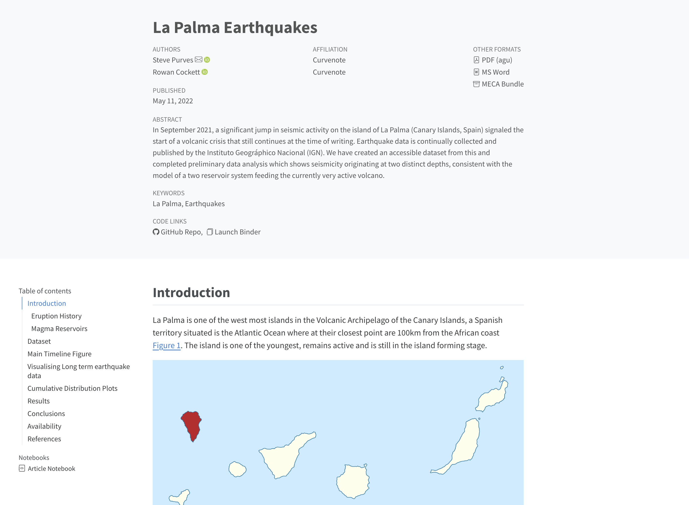

The following table has examples of JATS output that includes MECA and JATS exports from both MyST and Quarto. These were produced on Aug 14, 2023.

:::{list-table} Examples of full MECA bundle
:name: meca-examples

- - Thumbnail
  - Details
  - Live Article
  - MECA Download
- - 
  - Produced with `mystmd` v1.1.16
  - [Visit Article](https://notebooks-now.github.io/submission-myst-full/)
  - [meca.zip](./examples/meca-myst-full.zip)
- - 
  - Produced with `mystmd` v1.1.16
  - [Visit Article](https://notebooks-now.github.io/submission-myst-lite/)
  - [meca.zip](./examples/meca-myst-lite.zip)
- - 
  - Produced with `quarto` v1.4
  - [Visit Article](https://notebooks-now.github.io/submission-quarto-full/)
  - [meca.zip](./examples/meca-quarto-full.zip)
- - 
  - Produced with `quarto` v1.4
  - [Visit Article](https://notebooks-now.github.io/submission-quarto-lite/)
  - [meca.zip](./examples/meca-quarto-lite.zip)
